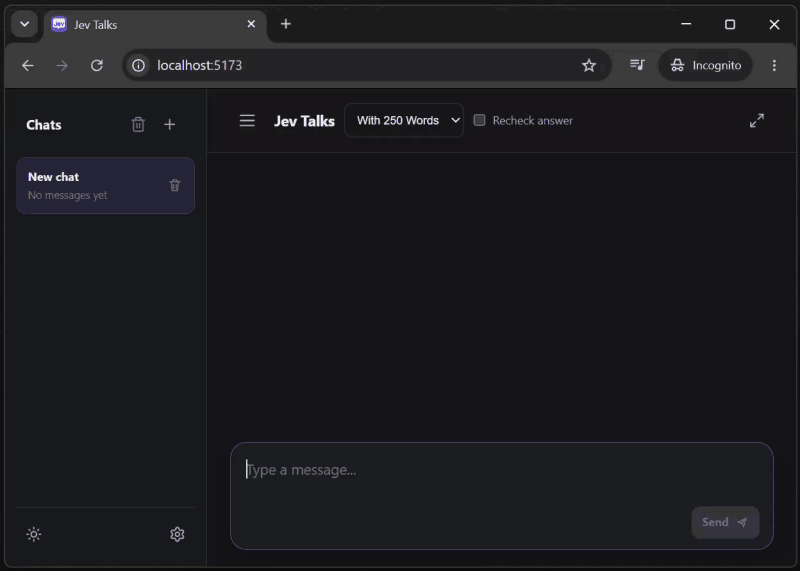
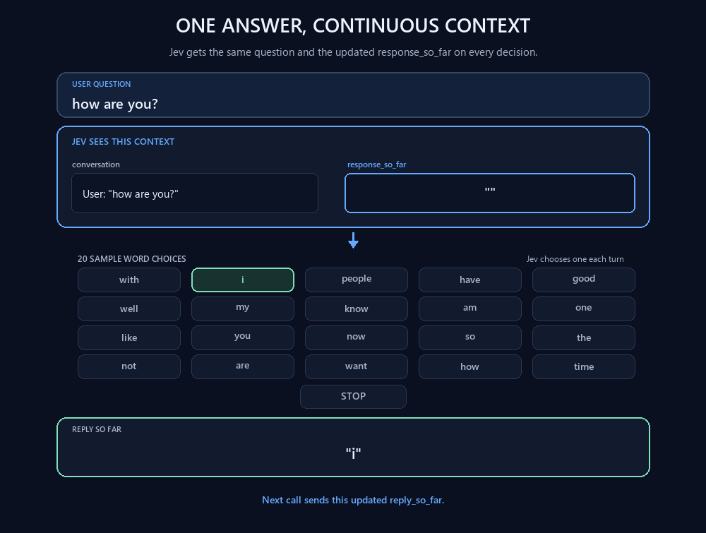

<p align="center">
  
</p>

<h1 align="center">Jev Talks</h1>

<p align="center">
  A decision-driven chat experience, one character or common word at a time.
</p>

<p align="center">
  <a href="https://jev-talks.vercel.app">https://jev-talks.vercel.app</a>
</p>

<p align="center">
  <a href="package.json"></a>
  <a href="LICENSE"></a>
</p>

<p align="center">
  
</p>

---

## How it works

<p align="center">
  
</p>

Each decision includes the full conversation in the selected chat and the reply generated so far. The fixed `jev-latest` model chooses from lowercase English and Turkish letters (with duplicates removed), digits, `. , ? !`, `SPACE`, and `STOP`. Jev is instructed to use `SPACE` only between words. The interface updates after every choice.

**With 250 Words** lets Jev choose one word at a time from a fixed list of 250 common English words. Jev sees the full list, the full conversation, and its reply so far on every call. The app inserts one space between selected words; `STOP` ends the answer. Word choices do not include punctuation.

Turn on **Recheck answer** beside the method selector to review the answer after `STOP`. Letter mode reviews one character at a time; **With 250 Words** reviews one word at a time and keeps replacements within the same list. This makes additional requests and updates the visible answer as replacements arrive. The option is off by default. Settings includes read-only defaults and lets visitors add their own prompt profiles without changing those defaults.

## Run locally

Use Node.js 20.19+ or 22.12+.

```sh
npm install
npm run dev
```

Vite serves both the React app and a local version of the `/api/jev` function. Open the URL printed by Vite. If you want to provide a shared key locally, copy `.env.example` to `.env.local` and set `TYPESAFE_AI_KEY`. Otherwise, the app asks for your personal TypeSafe key. You can also run `npm run test`, `npm run typecheck`, and `npm run build`.

Personal keys are stored only in that visitor's browser `localStorage`. The server uses them for each request without writing the keys to logs. Detailed request and response records are appended to `/tmp/jev-talks.log`; user messages, prompts, and TypeSafe responses are included, while API key fields and authorization headers are excluded. Vercel's `/tmp` storage is temporary and local to a server instance. Chats are also saved in browser `localStorage`. Each finished reply shows its backend request count.
